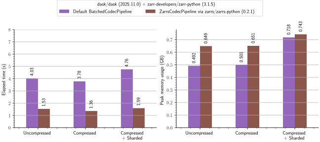
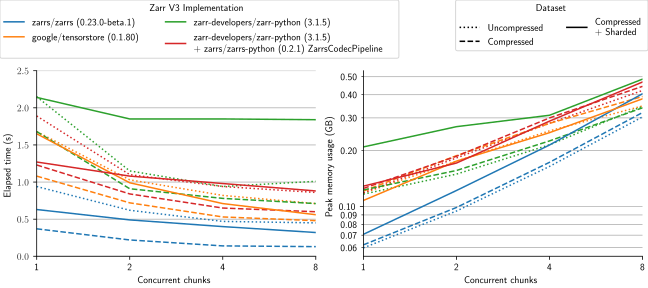
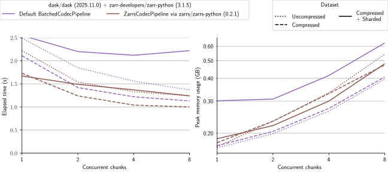
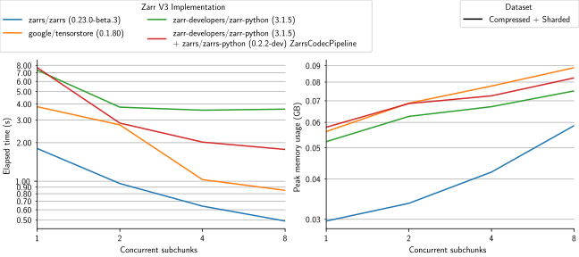
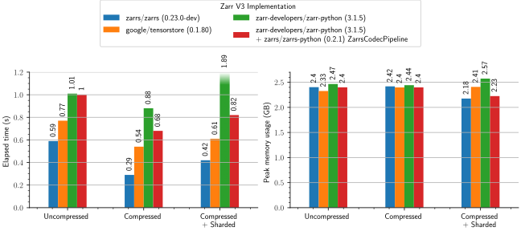
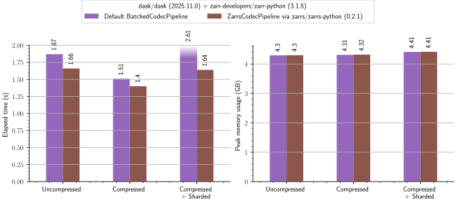

# Zarr Benchmarks

This repository contains benchmarks of Zarr V3 implementations.

> [!NOTE]
> Contributions are welcomed for additional benchmarks, more implementations, or otherwise cleaning up this repository.
>
> Also consider restarting development of the official Zarr benchmark repository: https://github.com/zarr-developers/zarr-benchmark

## Implementations Benchmarked
- [`zarrs/zarrs`](https://github.com/zarrs/zarrs) via [`zarrs/zarrs_tools`](https://github.com/zarrs/zarrs_tools)
  - Read executable: [zarrs_benchmark_read_sync](https://github.com/zarrs/zarrs_tools/blob/main/src/bin/zarrs_benchmark_read_sync.rs)
  - Round trip executable: [zarrs_reencode](https://github.com/zarrs/zarrs_tools/blob/main/src/bin/zarrs_reencode.rs)
- [`google/tensorstore`](https://github.com/google/tensorstore)
- [`zarr-developers/zarr-python`](https://github.com/zarr-developers/zarr-python)
  - With and without the `ZarrsCodecPipeline` from [`zarrs/zarrs-python`](https://github.com/zarrs/zarrs-python)
  - With and without [`dask`](https://github.com/dask/dask)

Implementation versions are listed in the benchmark charts.

> [!WARNING]
> Python benchmarks are subject to the overheads of Python and may not be using an optimal API/parameters.
>
> Please open a PR if you can improve these benchmarks.

## `make` Targets
 - `pydeps`: install python dependencies (recommended to activate a venv first)
 - `zarrs_tools`: install `zarrs_tools` (set `CARGO_HOME` to override the installation dir)
 - `generate_data`: generate benchmark data
 - `benchmark_read_all`: run [read all](#read-all-benchmark) benchmark
 - `benchmark_read_chunks`: run [chunk-by-chunk](#read-chunk-by-chunk-benchmark) benchmark
 - `benchmark_roundtrip`: run [roundtrip](#round-trip-benchmark) benchmark
 - `benchmark_all`: run all benchmarks

## Benchmark Data
All datasets are $1024x1024x1024$ `uint16` arrays.

| Name                               | Chunk / Shard Shape | Inner Chunk Shape | Compression | Size    |
|------------------------------------|---------------------|-------------------|-------------|---------|
| Uncompressed                       | $256^3$             | -                 | None        | 2.00 GB |
| Compressed                         | $256^3$             | -                 | `zstd` 0    | 83  MB |
| Compressed + Sharded               | $256^3$             | $64^3$            | `zstd` 0    | 439 MB |

## Benchmark System
- Dell 14 Pro Premium
  - CPU: Intel(R) Core(TM) Ultra 7 268V (8) @ 5.00 GHz
  - Memory: 32GB LPDDR5X 8533 MT/s 
  - SSD: 2TB EG6 KIOXIA
  - OS: Arch Linux (6.18.2)

## Round Trip Benchmark

This benchmark measures the minimum time and peak memory usage to "round trip" a dataset (potentially chunk-by-chunk).
 - The disk cache is cleared between each measurement
 - These are best of 5 measurements

[Table of raw measurements (benchmarks_roundtrip.md)](./measurements/benchmark_roundtrip.md)

### Standalone

### Dask

## Read Chunk-By-Chunk Benchmark

This benchmark measures the minimum time and peak memory usage to read a dataset chunk-by-chunk into memory.
 - The disk cache is cleared between each measurement
 - These are best of 5 measurements

[Table of raw measurements (benchmarks_read_chunks.md)](./measurements/benchmark_read_chunks.md)

### Standalone

> [!NOTE]
> `zarr-python` benchmarks with sharding are not visible in this plot

### Dask

## Read Subchunk-By-Subchunk Benchmark

This benchmark measures the minimum time and peak memory usage to read a dataset subchunk-by-subchunk into memory.
A subchunk is an inner chunk within a sharded chunk.
 - The disk cache is cleared between each measurement
 - These are best of 5 measurements

[Table of raw measurements (benchmarks_read_subchunks.md)](./measurements/benchmarks_read_subchunks.md)

### Standalone

## Read All Benchmark
This benchmark measures the minimum time and peak memory usage to read an entire dataset into memory.
 - The disk cache is cleared between each measurement
 - These are best of 5 measurements

[Table of raw measurements (benchmarks_read_all.md)](./measurements/benchmark_read_all.md)

### Standalone

### Dask

